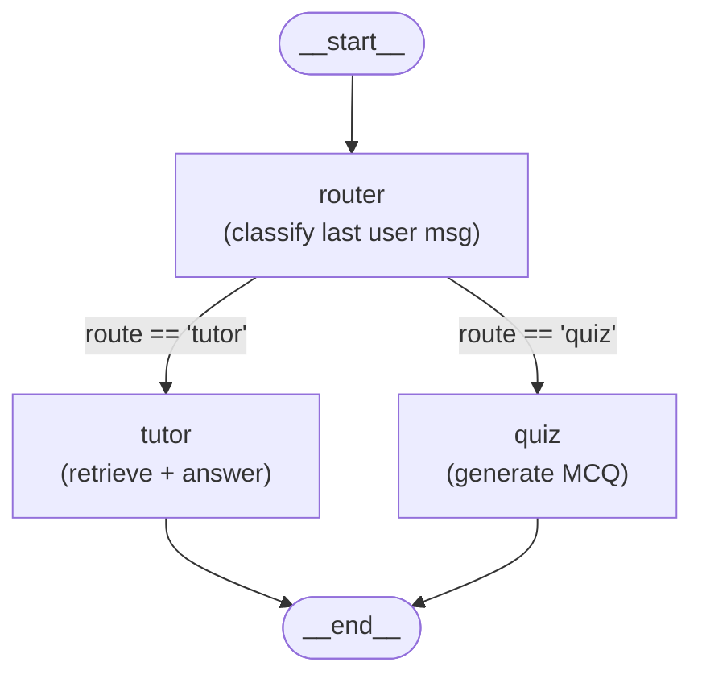
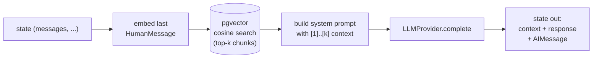
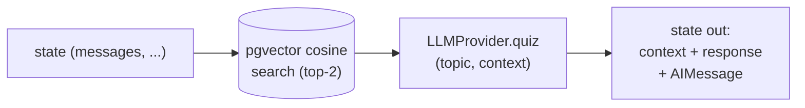
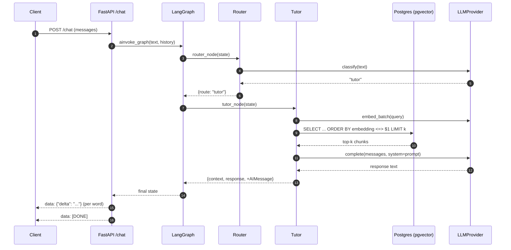

# LangGraph Orchestration — Diagrams

Visual reference for the multi-agent graph in `backend/app/agents/`. All diagrams are Mermaid; GitHub, GitLab, and most modern Markdown viewers render them inline.

## 1. Node flow (top-level)



The Router is the entry point. It writes `state["route"]` and **does not** produce an assistant message. The conditional edge then dispatches to exactly one of the two leaf agents, which both write `state["response"]` plus an `AIMessage` and terminate.

## 2. Tutor agent internals

The Tutor is the one node that touches pgvector. Internally it runs four sequential steps:



`Embed` uses `app.services.embeddings.get_embedding_provider()` (phase-1 stub: deterministic blake2b-seeded 768-d vectors). `Search` calls `app.services.retrieval.retrieve_top_k(session, query, k=4)` which uses `DocumentChunk.embedding.cosine_distance(...)`. `LLM` is the `LLMProvider` Protocol — `StubLLMProvider` in phase 2.

## 3. Quiz agent internals



The Quiz fetches a smaller amount of context (k=2) for grounding, then calls `LLMProvider.quiz(topic, context)`. The stub returns a templated 4-option MCQ; a real LLM should be prompted to ground the question in the retrieved snippets and include an answer key out-of-band.

## 4. State threading

What each node reads from and writes to `TutorState`:

| Node     | Reads                              | Writes                                                       |
|----------|------------------------------------ |--------------------------------------------------------------|
| Router   | `messages` (last HumanMessage)     | `route`                                                      |
| Tutor    | `messages` (last HumanMessage)     | `context`, `response`, `messages` (+ AIMessage)              |
| Quiz     | `messages` (last HumanMessage)     | `context`, `response`, `messages` (+ AIMessage)              |

`user_score` is currently **carried but not modified** by any node (phase 2). Grading + score updates land in phase 3.

`messages` uses the standard `add_messages` reducer, so every node-emitted message is appended to the accumulated history rather than replacing it. All other fields are replaced wholesale on write.

## 5. End-to-end request lifecycle

How a `POST /chat` becomes an SSE stream:



## 6. How to regenerate the top-level diagram

LangGraph can emit a fresh Mermaid graph from the compiled object — useful when nodes or edges change:

```python
from app.agents.graph import graph
print(graph.get_graph().draw_mermaid())
```

The hand-drawn diagrams in §1–§3 are more annotated than the auto-output; treat the auto-output as the authoritative shape and the diagrams here as the explanation.
